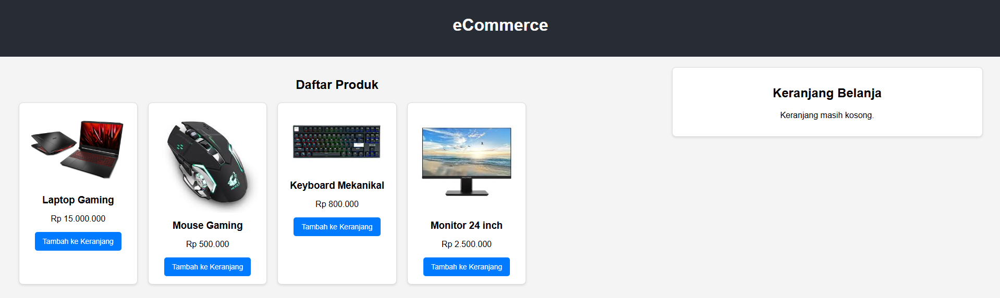

# eCommerce

Proyek ini adalah simulasi aplikasi e-commerce yang dibangun menggunakan React.js untuk front-end dan Node.js (Express.js) untuk back-end. Mendemonstrasikan kemampuan dalam membuat REST API, mengelola state aplikasi, dan menghubungkan client dengan server.

## Fitur Utama:

Tampilan produk dinamis yang datanya diambil dari API.
Keranjang belanja interaktif (tambah item, lihat total).
Simulasi proses checkout untuk mengirim data pesanan ke server.

### Teknologi Front-End:
React.js: Untuk membangun antarmuka pengguna yang dinamis.
React Hooks (useState, useEffect): Untuk mengelola state dan side effects.
Axios: Untuk melakukan panggilan HTTP ke back-end API.
CSS: Untuk styling dan tata letak yang responsif

### Teknologi Back-End:
Node.js: Sebagai lingkungan runtime JavaScript di sisi server.
Express.js: Untuk membangun REST API yang solid dan efisien.
CORS: Untuk mengelola izin akses antara front-end dan back-end.
Express Static Middleware: Untuk menyajikan file statis seperti gambar produk.

### Konsep yang Diterapkan:
Pengembangan Full-Stack
Arsitektur Client-Server
RESTful API Design
Manajemen State (Client-Side)
Komunikasi Asinkron (Async/Await)
